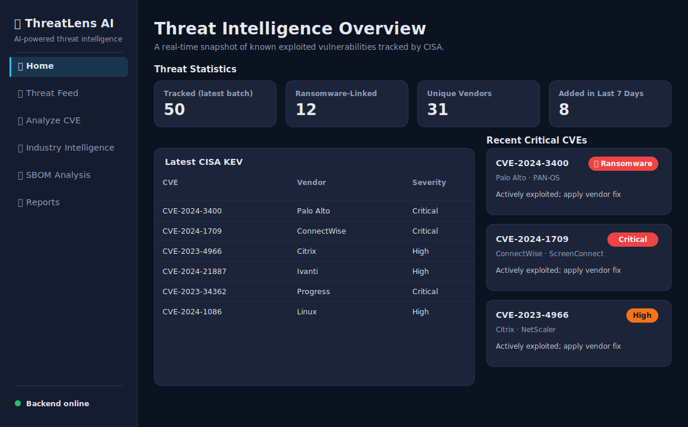
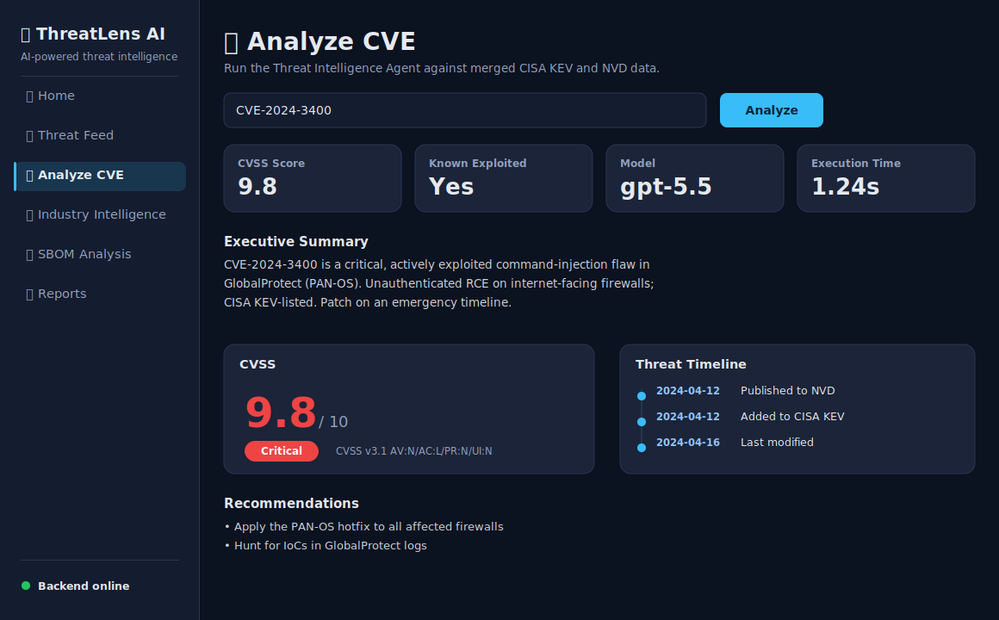
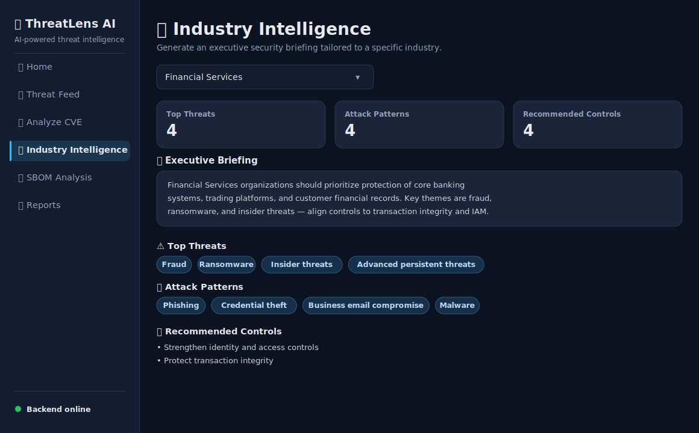
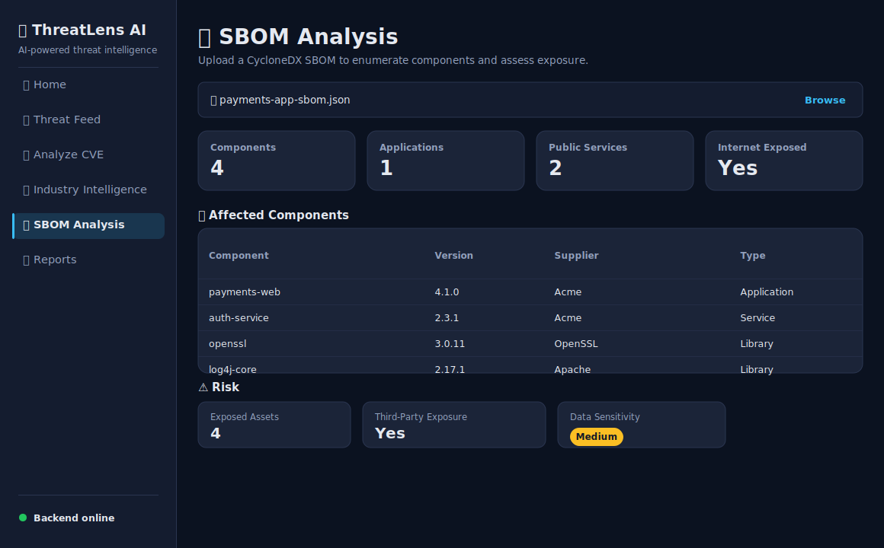
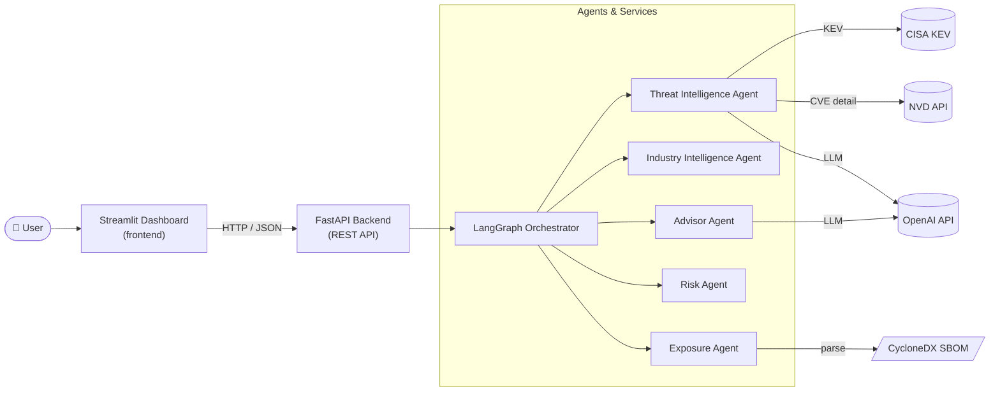
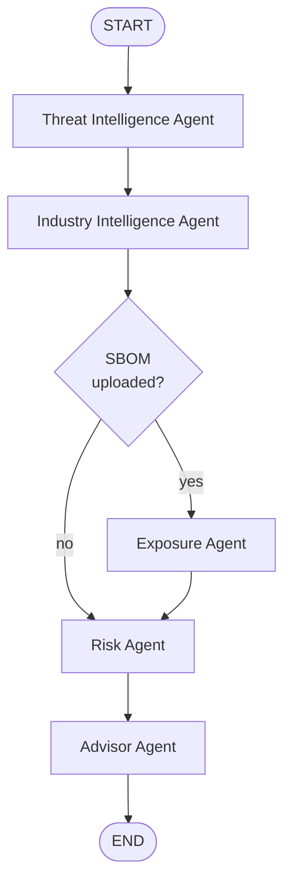

# 🛡️ ThreatLens AI

**AI-powered threat intelligence platform.** ThreatLens AI enriches CVEs with
CISA KEV and NVD data, runs a multi-agent LangGraph pipeline, and produces
executive-ready security advisories — served through a FastAPI backend and a
modern Streamlit dashboard.

> Built for authorized security research, CTF, and defensive use.

---

## ✨ Features

- **Threat Intelligence Agent** — merges CISA KEV + NVD data and generates a structured CVE report.
- **Industry Intelligence Agent** — executive security briefings tailored to an industry.
- **Exposure Agent** — derives an exposure profile from an uploaded CycloneDX SBOM.
- **Risk Agent** — deterministic risk scoring from threat, industry, and exposure signals.
- **Advisor Agent** — synthesizes everything into a Markdown security advisory.
- **LangGraph orchestration** — a typed, conditionally-routed agent pipeline.
- **Streamlit dashboard** — Home, Threat Feed, Analyze CVE, Industry Intelligence, SBOM Analysis, Reports.
- Response **caching**, graceful **error handling**, loading indicators, and a polished dark theme.

## 🖼️ Screenshots

> Themed UI previews (rendered from the app's actual palette).

| Home | Analyze CVE |
| --- | --- |
|  |  |

| Industry Intelligence | SBOM Analysis |
| --- | --- |
|  |  |

## 🏗️ Architecture



### Orchestration pipeline

The `/orchestrate/report` endpoint runs a typed LangGraph state machine with
conditional routing — the Exposure Agent only runs when an SBOM is supplied:



## 📁 Project structure

```
bootcamp-code/
├── app/                        # Core services (framework-agnostic)
│   ├── config.py               # Settings loaded from environment
│   ├── data/industries.json    # Industry threat profiles
│   └── services/               # CISA KEV, NVD, CycloneDX, Risk
├── threatlens_ai/
│   ├── agent/                  # Threat, Industry, Exposure, Advisor agents + orchestrator
│   ├── backend/                # FastAPI app, routes, schemas, DI, services
│   └── frontend/               # Streamlit app, pages, components, theme, cached data layer
├── docs/
│   ├── examples/               # Example reports generated from the real code
│   └── screenshots/            # UI previews
├── scripts/                    # Example/preview generators
├── tests/                      # Pytest + unittest suite
├── Dockerfile
├── docker-compose.yml
└── requirements.txt
```

## ✅ Prerequisites

- **Python 3.12+** (for local runs)
- **Docker + Docker Compose** (for containerized runs)
- API keys:
  - **OpenAI API key** — used by the Threat Intelligence and Advisor agents. Get one at <https://platform.openai.com/api-keys>.
  - **NVD API key** — used to query the National Vulnerability Database. Request one (free) at <https://nvd.nist.gov/developers/request-an-api-key>.

## 🔑 Configuration

All configuration is read from environment variables (loaded from a `.env`
file via `python-dotenv`). Copy the template and fill it in:

```bash
cp .env.example .env
```

| Variable | Required | Default | Description |
| --- | --- | --- | --- |
| `OPENAI_API_KEY` | ✅ | — | OpenAI key for the LLM-backed agents |
| `NVD_API_KEY` | ✅ | — | NVD API key for CVE enrichment |
| `OPENAI_MODEL` | — | `gpt-5.5` | OpenAI model id |
| `API_BASE_URL` | — | `http://localhost:8000` | Backend URL the frontend calls |
| `FASTAPI_HOST` | — | `0.0.0.0` | Backend bind host |
| `FASTAPI_PORT` | — | `8000` | Backend port |
| `ENVIRONMENT` | — | `production` | Deployment environment label |

## 🚀 Run locally

**1. Create a virtual environment and install dependencies**

```bash
python3.12 -m venv .venv
source .venv/bin/activate          # Windows: .venv\Scripts\activate
pip install -r requirements.txt
```

**2. Configure environment**

```bash
cp .env.example .env
# edit .env and set OPENAI_API_KEY and NVD_API_KEY
```

**3. Start the backend** (terminal 1)

```bash
uvicorn threatlens_ai.backend.main:app --reload --port 8000
```

Interactive API docs: <http://localhost:8000/docs>

**4. Start the frontend** (terminal 2)

```bash
streamlit run threatlens_ai/frontend/app.py
```

Dashboard: <http://localhost:8501>

## 🐳 Run with Docker

Docker Compose builds one image and runs two services: **backend** (FastAPI on
`:8000`) and **frontend** (Streamlit on `:8501`). The frontend waits until the
backend is healthy before starting.

### Step 1 — Create your `.env` file

The API keys are read by the **backend** service from a `.env` file in the
project root (referenced by `env_file: .env` in `docker-compose.yml`):

```bash
cp .env.example .env
```

### Step 2 — Add your keys to `.env`

Open `.env` and set the two required secrets. **They belong in `.env` in the
project root — not in the Dockerfile or docker-compose.yml** (never commit real
keys; `.env` is git-ignored):

```dotenv
# .env  (project root)
OPENAI_API_KEY=sk-your-real-openai-key-here
NVD_API_KEY=your-real-nvd-key-here

# Optional overrides (sensible defaults already apply)
OPENAI_MODEL=gpt-5.5
```

> ℹ️ You do **not** need to set `API_BASE_URL` for Docker — `docker-compose.yml`
> already points the frontend at the backend service (`http://backend:8000`).
> The keys only need to live in `.env`; the backend container loads them, and the
> frontend reaches the backend over the internal Docker network.

### Step 3 — Build and start

```bash
docker compose up --build
```

### Step 4 — Open the app

- Dashboard: <http://localhost:8501>
- API docs: <http://localhost:8000/docs>

Stop and remove the containers with:

```bash
docker compose down
```

**Troubleshooting**

- *Frontend shows "Backend offline":* the backend failed its healthcheck — check
  `docker compose logs backend`. The most common cause is a missing/invalid
  `OPENAI_API_KEY` or `NVD_API_KEY` in `.env`.
- *`.env` not found:* run `cp .env.example .env` in the project root before `docker compose up`.

## 🤗 Deploy to Hugging Face Spaces

Spaces exposes a single port, so ThreatLens AI ships as a **Docker Space** that
runs the backend and frontend together (see [`start.sh`](start.sh)). Streamlit is
served on the public port `7860`; the frontend reaches the backend internally at
`http://localhost:8000`.

1. **Create the Space** — on <https://huggingface.co/new-space>, choose **Docker → Blank**, and note the Space's git URL.
2. **Push the code** to the Space repo:
   ```bash
   git remote add space https://huggingface.co/spaces/<your-username>/<space-name>
   git push space sprint-10-changes:main
   ```
   The `README.md` YAML front matter (`sdk: docker`, `app_port: 7860`) tells the
   Space how to build and which port to serve.
3. **Add your keys as Space secrets** — in the Space, go to **Settings → Variables
   and secrets → New secret** and add (these are injected as environment
   variables at runtime; do **not** put them in a file):

   | Secret name | Value |
   | --- | --- |
   | `OPENAI_API_KEY` | your OpenAI key |
   | `NVD_API_KEY` | your NVD key |

   `OPENAI_MODEL` is optional (add it as a **Variable** to override the default).
   You do **not** need `API_BASE_URL` — the bundled backend is at `localhost:8000`.
4. **Wait for the build** — the Space builds the Docker image and starts. Once
   it's running, the dashboard is live at your Space URL.

> Tip: after adding or changing secrets, use **Settings → Factory rebuild** so the
> new values are picked up.

## 🌐 API endpoints

| Method | Path | Description |
| --- | --- | --- |
| `GET` | `/health` | Service health check |
| `GET` | `/threats/latest` | Latest CISA KEV entries |
| `POST` | `/cve/analyze` | Analyze a CVE (Threat Intelligence Agent) |
| `POST` | `/threat-intelligence/report` | Structured CVE report |
| `POST` | `/industry/report` | Industry security briefing |
| `POST` | `/sbom/analyze` | CycloneDX SBOM exposure analysis |
| `POST` | `/advisor/report` | Advisor Agent advisory |
| `POST` | `/orchestrate/report` | Full LangGraph pipeline |

## 📄 Example reports

Real outputs generated by the app's code paths (regenerate with
`python scripts/generate_examples.py`):

- [`docs/examples/advisory-report-CVE-2024-3400.md`](docs/examples/advisory-report-CVE-2024-3400.md)
- [`docs/examples/industry-briefing-financial-services.md`](docs/examples/industry-briefing-financial-services.md)
- [`docs/examples/sbom-analysis-sample.json`](docs/examples/sbom-analysis-sample.json)

## 🧪 Testing

```bash
pip install pytest
OPENAI_API_KEY=test NVD_API_KEY=test pytest -q
```

(The dummy keys satisfy config validation; the suite uses stubs and does not
make real network or OpenAI calls.)

## 🔒 Notes

- ThreatLens AI is intended for authorized, defensive security use.
- Data is sourced from public CISA KEV and NVD feeds; the LLM narrative is generated
  from that supplied context.
- Never commit real API keys. `.env` and `*.env` are git-ignored.
